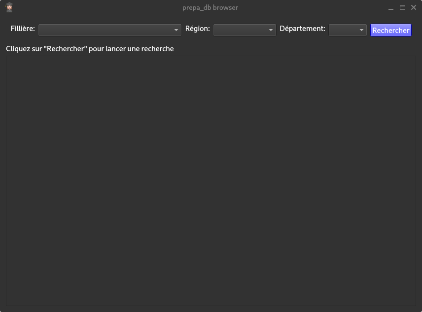

Copyright 2024 Elouan Deschamps TG1
Ce programme créé une base de donnée mysql/mariadb recensant les CPGE scientifiques françaises à partir de https://data.enseignementsup-recherche.gouv.fr et https://data.gouv.fr et permet son exploration grâce à une interface écrite avec Qt
# Technologies Employées, dépendances et prérequis
Du SQL et du python sont employés dans le projet, ainsi que des modules python dont:
* Pyside6
* sys
* requests
* csv
* mysql.connector

Prérequis:
* Un ordinateur hôte sous GNU/Linux ou Windows (Non testé sur d'autres systèmes)
* Un serveur mysql/mariadb lancé sur la machine hôte avec un utlisateur `elouand` de mot de passe `elouan` avec toutes les permissions OU  modifier les attributs de [prepa_db](py/create_db.py) (ligne 36)
* Un environnement graphique supportant Qt6
* Python en version 3 et tous les modules listés ci-dessus
# Schéma relationnel

Les Cardinalités sont présentes sur le diagramme ci-dessus, mais il se peu que celles ci s'affichent mal si le mode sombre est activé
# Interface graphique
L'interface permet de consulter des informations sur les différentes formations enrégistrées dans la base de données et est écrite avec le framework Qt en version 6 par le biais du module python Pyside6, voici comment elle se présente

3 Combobox dans la partie supérieure de l'écran permettent d'indiquer nos critères concernant la formation souhaitée, la requête au serveur mysql n'est effectuée qui si l'on appuie sur le bouton rechercher, les résulats de recherche et le nombre de resultats sont listés dans la partie inférieure de l'écran

# Tests et limites du programme
Voir [Tests.md](Tests.md)

