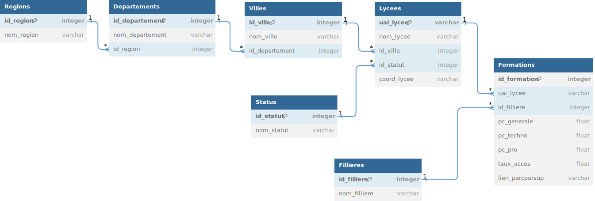

Ce programme créé une base de donnée mysql/mariadb recensant les CPGE scientifiques françaises à partir de https://data.enseignementsup-recherche.gouv.fr et https://data.gouv.fr et permet son exploration grâce à une interface écrite avec Qt
# Technologies Employées 
Du SQL et du python sont employés dans le projet, ainsi que des modules python dont:
* Pyside6
* sys
* requests
* csv
* mysql.connector
# Schéma relationnel

# Interface graphique
L'interface
