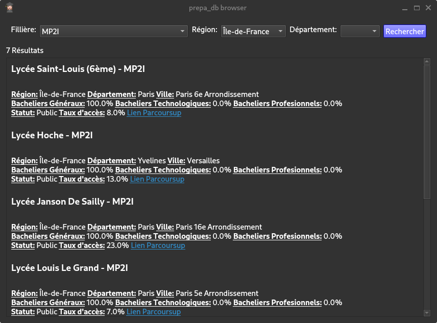
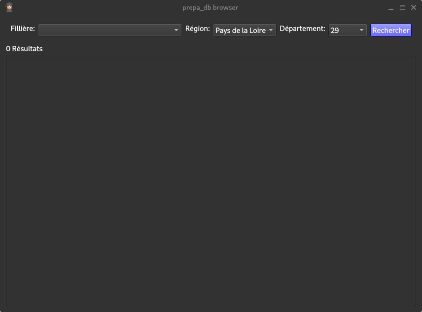

Ce fichier recence les tests du programme
# Recherches et requêtes
* Si une combobox est laissé vide puis que le bouton rechercher est cliqué, le critère ne sera pas pris en compte dans la requête SQL ce qui permet d'élargir la recherche (ex: Rechercher l'intégralité des MP2I d'île de France) 

* Si un département est sélectionné alors qu'il ne fait pas partie de la régions sélectionnée, aucun résultat ne s'affiche 
# Affichage
* La fenêtre peut s'afficher aussi bien en fond noir qu'en fond blanc selon la configuration du système hôte. Grâce le cadre s'affichant autour de chaque résultat de recherche lorsqu'on y passe la souris est gris (Il resort aussi bien sur fonc noir que sur fond blanc)